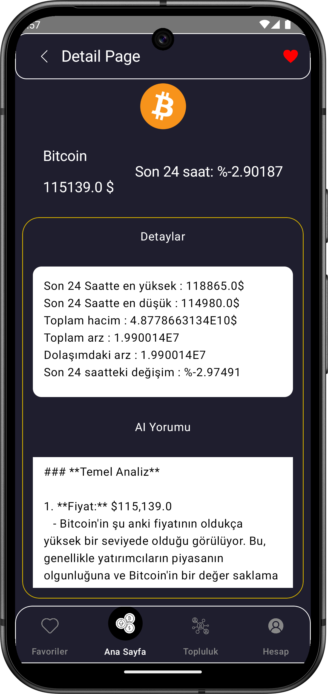

Quantora: Yapay Zekâ Destekli Dijital Kripto Varlık Analiz ve Takip Uygulaması 
** Kripto para piyasalarının dinamik yapısı, bireysel yatırımcıların gerçek zamanlı ve anlamlı 
  verilere ulaşmasını her geçen gün daha önemli hâle getirmiştir. Bu ihtiyaçtan yola çıkılarak 
  geliştirilen Quantora adlı mobil uygulama, kullanıcıların kripto varlıkları detaylı şekilde analiz 
  edebilmesini, yatırım kararlarını destekleyecek bilgilerle donatılmasını ve finansal varlıklarını 
  dijital ortamda yönetmesini amaçlayan, yapay zekâ destekli modern bir mobil platformdur. 
  Uygulama, Kotlin programlama dili ile Jetpack Compose mimarisi kullanılarak geliştirilmiş; 
  CoinGecko API üzerinden alınan veriler, Retrofit ve RxJava kütüphaneleri yardımıyla çekilerek 
  kullanıcıya sunulmuştur. Kullanıcılar, güncel fiyatlar, yüzde değişimleri ve coin detayları gibi 
  verilere erişebilirken; OpenAI tabanlı yapay zekâ modülü sayesinde seçili kripto varlıklara dair 
  doğal dilde yatırım analizleri ve yorumlar alabilmektedir. 
  Quantora, aynı zamanda bir cüzdan modülü barındırmakta olup kullanıcıların dijital para 
  yatırma, çekme işlemlerini simüle edebileceği ve kart bilgilerini güvenli bir şekilde yönetebileceği 
  bir altyapı sunar. Verilerin tamamı Firebase Firestore üzerinde saklanmakta; kullanıcı kimlik 
  doğrulama işlemleri Firebase Authentication ile sağlanmaktadır. Favori varlık listesi, 
  topluluk etkileşim alanı ve profil yönetimi gibi özellikler, kullanıcıların uygulama ile 
  etkileşimini artırmaktadır. 
  Tasarım açısından uygulama, sade ve kullanıcı dostu bir arayüz sunmakta; Google Fonts, 
  BottomBar, AppBar, Navigation, Swipe Refresh, SharedPreferences gibi yapılar ile hem 
  görsel hem de teknik anlamda modern bir kullanıcı deneyimi hedeflenmiştir.

  Quantora: An AI-Powered Digital Crypto Asset Analysis and Tracking Application 

**The dynamic nature of cryptocurrency markets has made it increasingly essential for individual 
  investors to access real-time and meaningful data. Developed in response to this need, the 
  mobile application Quantora is a modern, AI-supported digital platform designed to enable 
  users to perform in-depth analysis of crypto assets, support investment decisions with 
  actionable insights, and manage their financial assets in a digital environment. 
  The application was developed using the Kotlin programming language and the Jetpack 
  Compose architecture. Data is retrieved via the CoinGecko API using the Retrofit and RxJava 
  libraries and presented to the user. Users can access up-to-date prices, percentage changes, 
  and detailed coin information, while the OpenAI-powered artificial intelligence module provides 
  natural language investment analysis and commentary for selected crypto assets. 
  Quantora also includes a wallet module that allows users to simulate digital deposit and 
  withdrawal transactions and manage card information securely. All data is stored on Firebase 
  Firestore, and user authentication is managed via Firebase Authentication. Features such as 
  favorite asset lists, a community interaction area, and profile management enhance user 
  engagement with the application. 
  From a design perspective, the application offers a clean and user-friendly interface. 
  Components such as Google Fonts, BottomBar, AppBar, Navigation, Swipe Refresh, and 
  SharedPreferences are utilized to provide a modern and visually appealing user experience 
  both functionally and aesthetically. 

  
  
  
